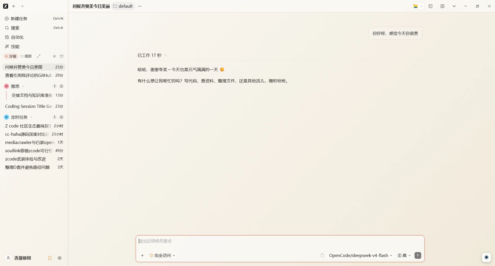
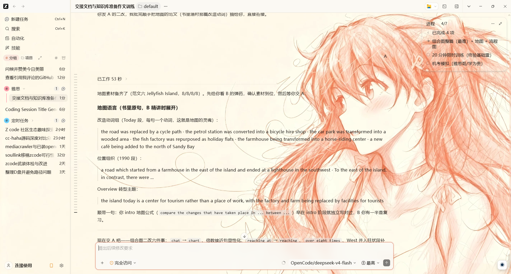

# Claude Style ZCode · 浅色皮肤包

给 [Dream Work Theme](https://github.com/xxxhh336/dream-work-theme) 用的 ZCode 浅色主题包：Claude 官方色系（珊瑚橙 + 品牌蓝 + 暖白层级）。非 Anthropic 官方产品，不修改官方安装包 / `app.asar` / WindowsApps。

包含两个版本，仓库里是**解压即用的主题文件夹**，直接整个复制进 `themes/` 即可：

| 版本 | 主题文件夹 | 特点 |
| --- | --- | --- |
| **Claude Eva Official**（明日香版） | `claude-eva-official/` | 动漫少女背景 + 透明消息，氛围感强 |
| **Claude Eva Clean**（纯净版） | `claude-eva-official-clean/` | 细腻暖色渐变背景 + 透明消息，更克制 |

**纯净版（Claude Eva Clean）效果：**



**明日香版（Claude Eva Official）效果：**



> 预览图为真实 ZCode 界面截图（浅色模式），仅作展示。

## 依赖

- [Dream Work Theme](https://github.com/xxxhh336/dream-work-theme) **v1.2.0 及以上**（CDP 注入换肤工具，Apache-2.0）
- ZCode 桌面端，且已在 ZCode「设置 → 外观」切换到浅色模式

> ✅ 上游 v1.2.0 起已合并 generic 应用 `theme.css` 注入补丁（[PR #1](https://github.com/xxxhh336/dream-work-theme/pull/1)），ZCode 的输入框圆角、消息透明、侧边栏指示条等组件级样式开箱即用，**无需任何补丁或 fork**。低于 v1.2.0 的版本只能得到基础四色配色。

## 安装

### 第一步：安装 Dream Work Theme（v1.2.0+）

到上游 [Dream Work Theme Releases](https://github.com/xxxhh336/dream-work-theme/releases) 下载 v1.2.0 及以上版本安装包（Windows 选 `Dream-Work-Theme-*-win-x64.exe`）。

### 第二步：下载主题 ZIP

点本仓库右上角 **Code → Download ZIP**，解压后得到 `claude-style-zcode-main/`，里面有两个主题文件夹：`claude-eva-official/` 和 `claude-eva-official-clean/`。

### 第三步：复制进主题目录

打开 Dream Work Theme 的**用户主题目录**（目录不会自动创建，先手动新建 `themes` 文件夹）：

| 平台 | 用户主题目录 |
| --- | --- |
| **macOS** | `~/Library/Application Support/dream-work-theme/themes/`（Finder 按 `Cmd+Shift+G` 直达） |
| **Windows** | `%APPDATA%\dream-work-theme\themes\`（即 `C:\Users\<用户名>\AppData\Roaming\dream-work-theme\themes\`，资源管理器地址栏粘贴后回车） |
| **Linux** | `~/.config/dream-work-theme/themes/` |

把解压出来的 **两个主题文件夹整个复制** 进 `themes/`，最终结构是：

```
themes/
├── claude-eva-official/
│   ├── theme.json
│   ├── theme.css
│   └── hero.webp
└── claude-eva-official-clean/
    ├── theme.json
    ├── theme.css
    └── hero.webp
```

> 目录层级必须是 `themes/<主题名>/theme.json` 这样，不要把 `theme.json` 散在 `themes/` 下，也不要套多余一层文件夹。

### 第四步：启动注入

1. 启动 Dream Work Theme
2. 选择 ZCode
3. 选择主题 `claude-eva-official`（明日香版）或 `claude-eva-official-clean`（纯净版）
4. 点击「应用主题」

## 文件结构

```
.
├── claude-eva-official/       # 明日香版（动漫少女背景）
│   ├── theme.json             # 主题声明（Claude 色系 palette）
│   ├── theme.css              # 组件级样式（composer / message / sidebar / 微交互）
│   └── hero.webp              # 背景图（2848×1600）
├── claude-eva-official-clean/ # 纯净版（渐变背景）
│   ├── theme.json
│   ├── theme.css
│   └── hero.webp
├── docs/
│   ├── clean.png              # 纯净版效果图
│   └── asuka.png              # 明日香版效果图
├── LICENSE
└── README.md
```

## 主题信息

- `id`：`claude-eva-official`（明日香版）/ `claude-eva-official-clean`（纯净版）
- 外观：`light`
- 支持：ZCode（`apps.zcode.compat: true`）
- 能力：`background` / `safe-css`

### 配色（Claude 官方 `data-theme=claude` light 变量转译）

| 键 | 色值 | 用途 |
| --- | --- | --- |
| `accent` | `#D97757` | 珊瑚橙主强调（按钮 / 指示条 / 输入框描边） |
| `secondary` | `#2E82DA` | 品牌蓝（链接 / hover 点缀） |
| `surface` | `#FAF9F5` | 暖白兜底底色 |
| `text` | `#211F1C` | 暖黑正文 |

### 组件细节

- 输入框：珊瑚橙圆角描边（伪元素实现，规避 sticky 合成下 `border-radius` 渲染异常），底色与顶部栏一致
- 消息容器：全透明，文字直接落在背景上
- 侧边栏：任务行珊瑚左指示条、hover 微光、功能区按钮蓝色 hover
- 微交互：图标位移 2px / 按钮按压 0.98 / 气泡 hover 珊瑚边

## 素材来源与权利声明

背景图（`hero.webp`，明日香版）基于 Claude EVA 主题素材包为基底，经 AI 再生成，公开再分发 / 商用前请自行确认素材、肖像与商标权利。背景不代表 Anthropic / Claude 官方视觉或背书。纯净版背景为程序生成的渐变图，无第三方素材。

## 上游说明

- 本项目基于 [Dream Work Theme](https://github.com/xxxhh336/dream-work-theme)（Apache-2.0）开发，主题格式与代码参考其通用写法（`themes/<id>/theme.json` + `theme.css` + hero）。
- ZCode 属于 generic-work 应用：上游 v1.2.0 起支持注入主题自带 `theme.css`（`readThemeCss`）并修复 file:// 页面 blob 背景，本主题的全部组件级样式因此开箱即用。
- 早期版本（< v1.2.0）对 generic 应用只注入自动生成的通用兜底皮肤，不读取 `theme.css`，仅能得到基础四色配色。

## 许可

本主题包代码与声明文件采用 [MIT License](LICENSE)。背景图素材按上方的权利声明处理，请自行确认再分发权利。
