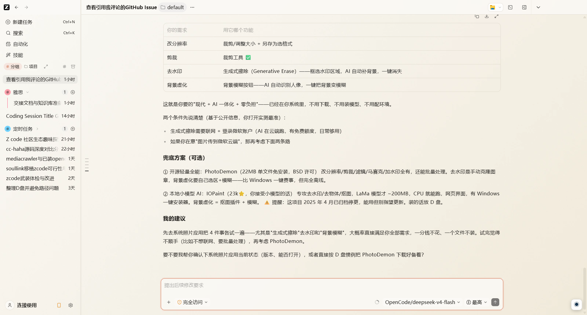

# Claude Style ZCode · 浅色皮肤包

给 [Dream Work Theme](https://github.com/xxxhh336/dream-work-theme) 用的 ZCode 浅色主题包：Claude 官方色系（珊瑚橙 + 品牌蓝 + 暖白层级）。非 Anthropic 官方产品，不修改官方安装包 / `app.asar` / WindowsApps。

包含两个版本：

| 版本 | 目录 | 特点 |
| --- | --- | --- |
| **Claude Eva Official**（明日香版） | 根目录 | 动漫少女背景 + 透明消息，氛围感强 |
| **Claude Eva Clean**（纯净版） | `clean/` | 细腻暖色渐变背景 + 透明消息，更克制 |



> 预览图为真实 ZCode 界面截图（浅色模式），仅作展示。

## 依赖

- [Dream Work Theme](https://github.com/xxxhh336/dream-work-theme)（CDP 注入换肤工具，Apache-2.0）
- ZCode 桌面端，且已在 ZCode「设置 → 外观」切换到浅色模式

## 安装

### 明日香版（根目录）

1. 克隆本仓库（或只下载 `theme.json`、`theme.css`、`hero.webp` 三个文件，不要套多余目录）。
2. 放入 Dream Work Theme 的主题目录：

   ```
   <dream-work-theme>/themes/claude-eva-official/
   ├── theme.json
   ├── theme.css
   └── hero.webp
   ```

3. 启动注入：

   ```bash
   cd <dream-work-theme>
   npx electron . --launch=zcode:claude-eva-official
   ```

### 纯净版（clean/）

把 `clean/` 目录整体复制为 `<dream-work-theme>/themes/claude-eva-official-clean/`，然后：

```bash
npx electron . --launch=zcode:claude-eva-official-clean
```

> 本主题为 ZCode（generic-work 应用）提供了精细的组件级样式（输入框圆角、消息透明、侧边栏指示条等），需要 Dream Work Theme 支持 generic 应用的 `theme.css` 注入（见下方「上游说明」）。

## 文件结构

```
.
├── theme.json       # 明日香版主题声明（Claude 色系 palette）
├── theme.css        # 明日香版组件级样式（composer / message / sidebar / 微交互）
├── hero.webp        # 明日香版背景图（动漫少女，2848×1600）
├── clean/           # 纯净版（渐变背景）
│   ├── theme.json
│   ├── theme.css
│   └── hero.webp
└── docs/preview.png # 实际界面预览截图
```

## 主题信息

- `id`：`claude-eva-official`（明日香版）/ `claude-eva-official-clean`（纯净版）
- 外观：`light`
- 支持：ZCode（`apps.zcode.compat: true`）
- 能力：`background` / `safe-css`

### 配色（Claude 官方 `data-theme=claude` light 变量转译）

| 键 | 色值 | 用途 |
| --- | --- | --- |
| `accent` | `#D97757` | 珊瑚橙主强调（按钮 / 指示条 / 输入框描边） |
| `secondary` | `#2E82DA` | 品牌蓝（链接 / hover 点缀） |
| `surface` | `#FAF9F5` | 暖白兜底底色 |
| `text` | `#211F1C` | 暖黑正文 |

### 组件细节

- 输入框：珊瑚橙圆角描边（伪元素实现，规避 sticky 合成下 `border-radius` 渲染异常），底色与顶部栏一致
- 消息容器：全透明，文字直接落在背景上
- 侧边栏：任务行珊瑚左指示条、hover 微光、功能区按钮蓝色 hover
- 微交互：图标位移 2px / 按钮按压 0.98 / 气泡 hover 珊瑚边

## 素材来源与权利声明

背景图（`hero.webp`，明日香版）基于 Claude EVA 主题素材包为基底，经 AI 再生成，公开再分发 / 商用前请自行确认素材、肖像与商标权利。背景不代表 Anthropic / Claude 官方视觉或背书。纯净版背景为程序生成的渐变图，无第三方素材。

## 上游说明

- 本项目基于 [Dream Work Theme](https://github.com/xxxhh336/dream-work-theme)（Apache-2.0）开发，主题格式与代码参考其通用写法（`themes/<id>/theme.json` + `theme.css` + hero）。
- ZCode 属于 generic-work 应用：Dream Work Theme 原版对 generic 应用只注入自动生成的通用兜底皮肤，不读取 `theme.css`。本主题的组件级样式需要上游支持 generic 应用的 `theme.css` 注入，对应的上游补丁见 [PR 链接](https://github.com/xxxhh336/dream-work-theme/pull/1)（`readThemeCss` / blob 修复 / 注入后自动退出）。

## 许可

本主题包代码与声明文件采用 [MIT License](LICENSE)。背景图素材按上方的权利声明处理，请自行确认再分发权利。
